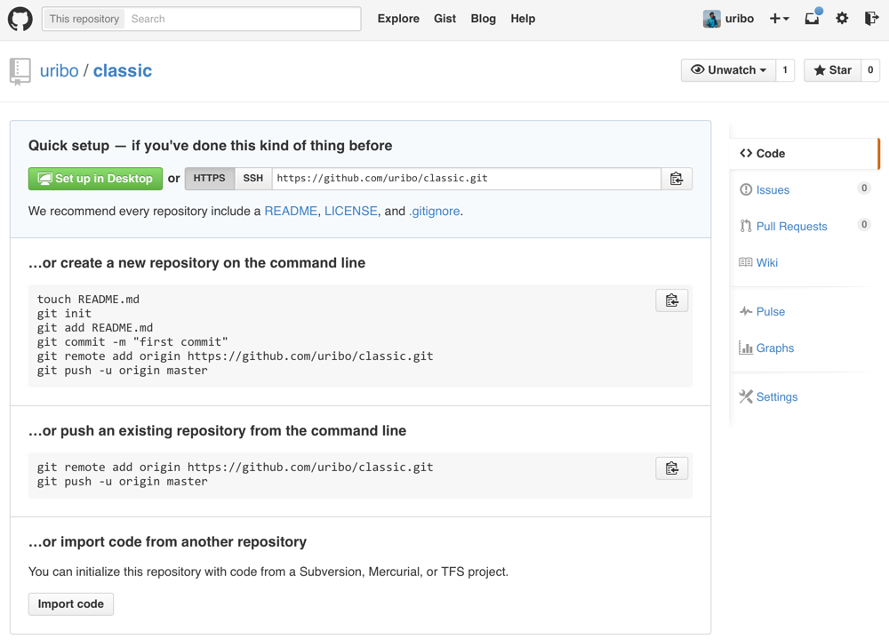

# リモートリポジトリ

Gitが分散バージョン管理である所以となるのはリモートリポジトリを扱えるという理由がある。リモートリポジトリとは、一人の環境内で作成、更新されるローカルリポジトリとは異なり、複数の環境下で動作し、また管理が行われるリポジトリとなる。

クローンと呼ばれるリポジトリのコピーを別環境にコピーすることで、元のリポジトリとは独立して作業を行える。クローンされたリポジトリは、通常のリポジトリと同様、個々のローカル環境でリポジトリの運営が行えるため、複数人が共同作業する場面においても、それぞれが独立し、なおかつオフラインでも更新ができるという利点がある。複数人での作業の際には、リモートリポジトリの使用は不可欠であり、この機能があるためにGitは発展を遂げている。

## GitHubでのリモートリポジトリ作成

GitHubからリポジトリを作成すれば良いが、既存のローカルリポジトリをGitHubで公開するリモートリポジトリとするにはどうすれば？（2014-12-29）

